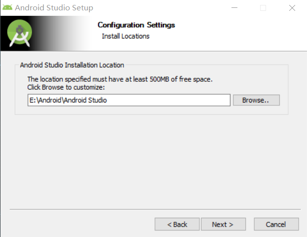
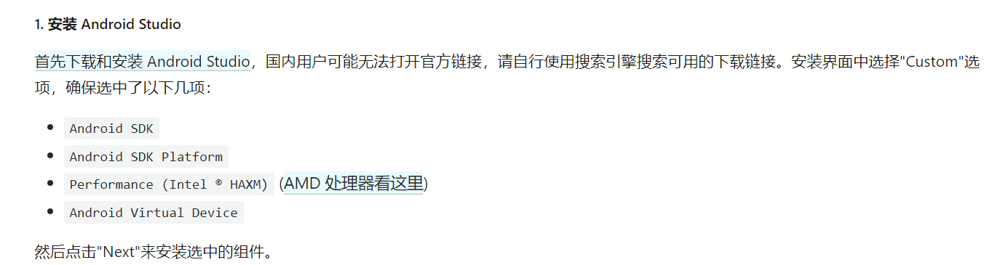
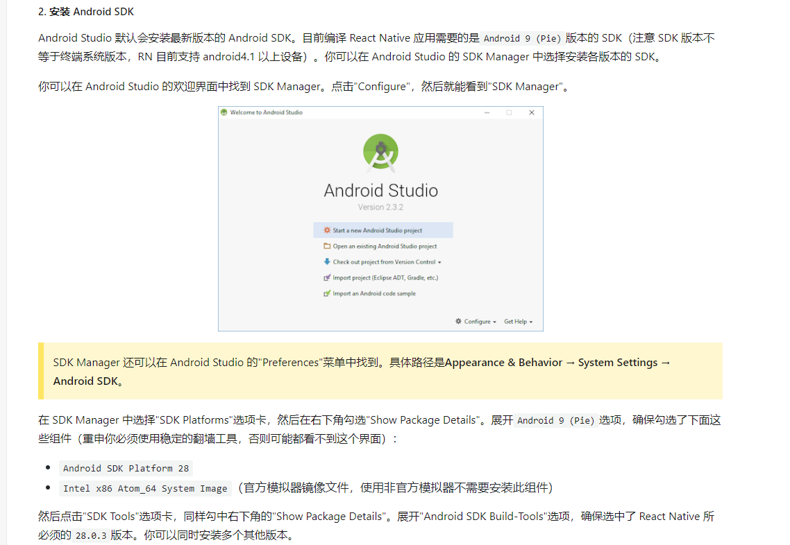
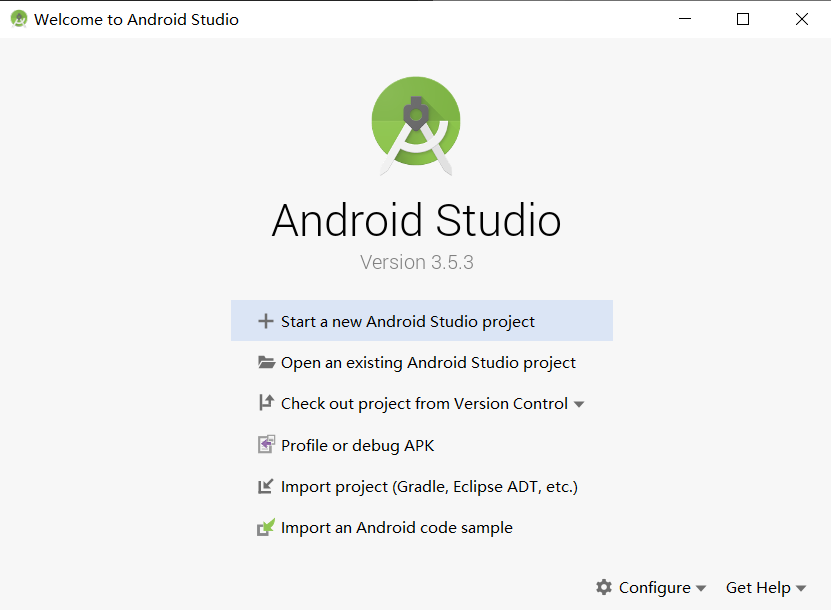
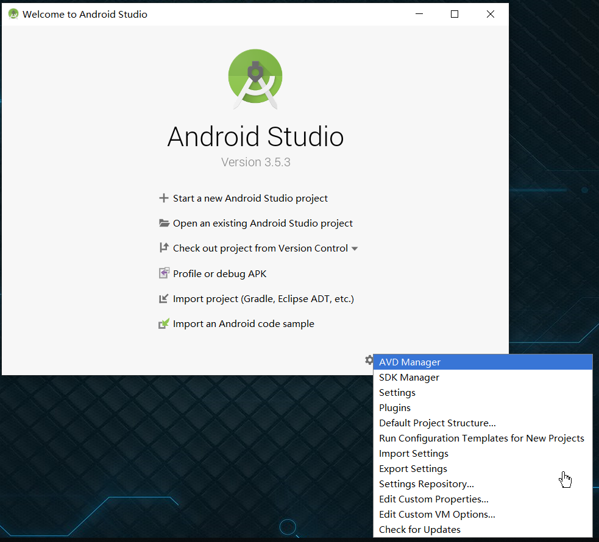
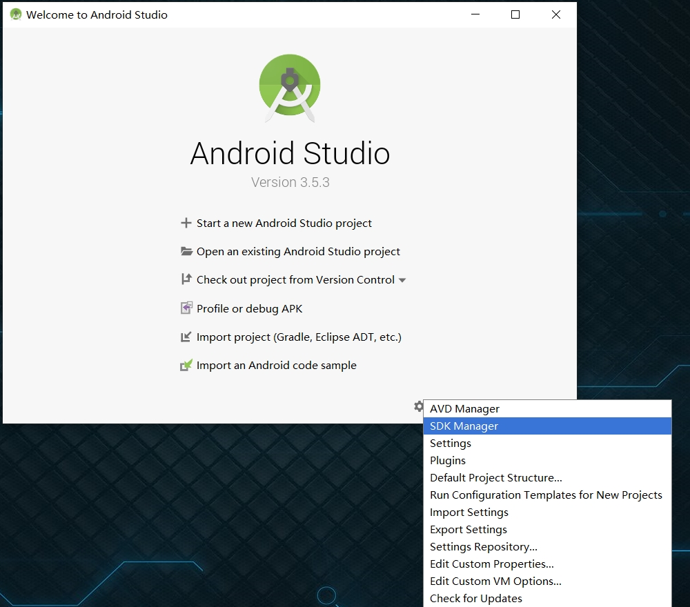
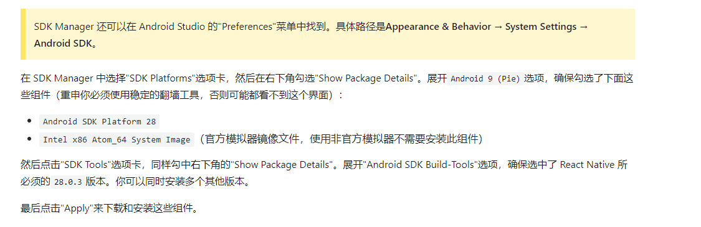
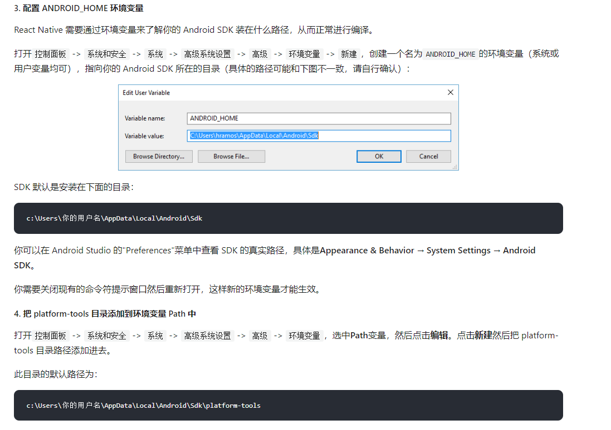
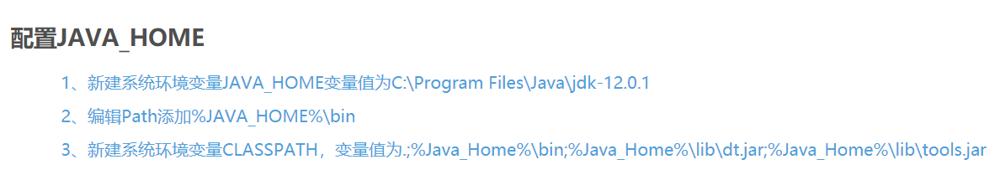

<h2>React Native</h2>

<!-- TOC -->

- [一. 线上API](#%e4%b8%80-%e7%ba%bf%e4%b8%8aapi)
- [二. 基于Windows环境部署](#%e4%ba%8c-%e5%9f%ba%e4%ba%8ewindows%e7%8e%af%e5%a2%83%e9%83%a8%e7%bd%b2)
- [三. React Native Swiper setup](#%e4%b8%89-react-native-swiper-setup)
- [四. React Native Navigation setup](#%e5%9b%9b-react-native-navigation-setup)

### 一. 线上API
① <a href="https://reactnative.cn/docs/getting-started/">React Native中文网</a>
<br />
②<a href="https://blog.csdn.net/qq_42017152/article/details/90732057">JAVA_Home环境变量配置</a>
<br />
③<a href="https://pan.baidu.com/s/1Y3gVYEWx2GSFp_uWLdZDeA">所需依赖包(BaiduYun)</a>，提取码：33i6
<br />
④<a href="https://github.com/leecade/react-native-swiper">React Swiper Github</a>
<br />
⑤<a href="https://reactnavigation.org/zh-Hans/">React Navigation官网</a>

### 二. 基于Windows环境部署

1. 必须安装的依赖有：Node、Python2、JDK 和 Android Studio。
<br />

2. Python2、JDK的安装，<b>注意：需要知道JDK的安装路径，配置环境变量要用到</b>
<br />

3. Android Studio的安装
-  ①配置Android Studio 的安装目录


- Android SDK的安装
  - 官网说明
  <b>图1:官网所需依赖</b>
  
  <b>图2:官网所需环境</b>
  
  <br />
  - ②安装流程
  步骤一：配置Android SDK的安装目录
  
  <br />
   步骤二：通过configure，配置SDK的依赖
  
  <br />
   步骤三：通过AVD Manager，配置安卓虚拟机
  
  <br />
   步骤四：通过SDK Manager，配置安卓平台环境
  <b>图1:SDK配置入口</b>
  
  <b>图2:SDK环境配置</b>
  
<br />

4. Windows环境变量配置
  <br />
  <b>图1:ANDROID_HOME环境变量配置</b>
  
  <br />
  <b>图2:JAVA_HOME环境变量配置</b>
  

5. Start: Hello React Native
``` cmd

npx react-native init AwesomeProject

npx react-native run-android

```

### 三. React Native Swiper setup

```cmd

yarn add react-native-swiper --save

```

recommand:
```cmd

yarn add --save react-native-swiper@nightly

```

### 四. React Native Navigation setup

①：第一步
```cmd

yarn add @react-navigation/native @react-navigation/stack -S

yatn add react-native-reanimated react-native-gesture-handler react-native-screens react-native-safe-area-context @react-native-community/masked-view -S

```

②：第二步: 进入android/app/build.gradle，在dependencies复制以下方式
```

implementation 'androidx.appcompat:appcompat:1.1.0-rc01'
implementation 'androidx.swiperefreshlayout:swiperefreshlayout:1.1.0-alpha02'

```

③: 第三步（看需求）：其它安装
```cmd

yarn add @react-navigation/bottom-tabs -S

```